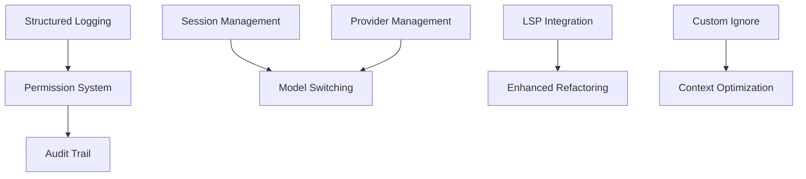

# SuperGrok-CLI Improvement Roadmap

Based on Crush feature analysis - **10 features to implement over 10 weeks**

---

## Quick Implementation Guide

### 🔥 Phase 1: High-Impact Features (Weeks 1-4)

```
Week 1-2: LSP Integration
├── TypeScript LSP (gopls for future)
├── Symbol resolution & definitions
├── Type information queries
└── Cross-file reference tracking

Week 2-3: Session Management
├── Session CRUD operations
├── SQLite storage (~/.grok/sessions/)
├── CLI commands (create/list/switch)
└── Session export (JSON/Markdown)

Week 3: Mid-Session Model Switching
├── Dynamic model change
├── History preservation
├── CLI command (/model <name>)
└── Cost tracking across switches

Week 4: Structured Logging
├── Winston/Pino integration
├── Rotating log files (~/.grok/logs/)
├── CLI commands (logs/--tail/--follow)
└── Log filtering by level/type
```

### ⚡ Phase 2: Medium-Impact Features (Weeks 5-7)

```
Week 5: Provider Management
├── Dynamic provider registry
├── CLI commands (add/list/test)
├── Remote provider updates
└── Provider validation

Week 6: Permission System
├── Tool approval prompts
├── --yolo bypass mode
├── Per-tool approval memory
└── Audit trail

Week 7: Custom Ignore Files
├── .grokignore parsing
├── Micromatch integration
├── Combine with .gitignore
└── Pattern validation
```

### ✨ Phase 3: Polish Features (Weeks 8-10)

```
Week 8: Attribution & Privacy
├── Automatic commit attribution
├── PR description templates
├── Telemetry controls
└── GDPR compliance

Week 9-10: Cross-Platform Testing
├── GitHub Actions CI matrix
├── Platform-specific fixes
├── BSD variant testing
└── Documentation updates
```

---

## Feature Dependencies



---

## Quick Start: Implement First 3 Features

### 1. Mid-Session Model Switching (2 days)

```typescript
// Add to src/grok/client.ts
async switchModel(newModel: string): Promise<void> {
  this.currentModel = newModel;
  await this.settingsManager.updateProjectSettings({ model: newModel });
}

// Add to src/ui/components/chat-interface.tsx
const handleModelSwitch = async (model: string) => {
  await agent.client.switchModel(model);
  setChatHistory((prev) => [
    ...prev,
    { type: 'system', content: `Switched to ${model}`, timestamp: new Date() }
  ]);
};
```

**Test**:
```bash
grok
> /model grok-4-latest
✅ Switched to grok-4-latest
> continue our conversation about...
```

---

### 2. Structured Logging (2-3 days)

```typescript
// Install winston
bun add winston

// Create src/utils/logger.ts
import winston from 'winston';

export const logger = winston.createLogger({
  level: 'info',
  format: winston.format.combine(
    winston.format.timestamp(),
    winston.format.json()
  ),
  transports: [
    new winston.transports.File({
      filename: path.join(os.homedir(), '.grok', 'logs', 'grok.log'),
      maxsize: 10485760, // 10MB
      maxFiles: 5
    })
  ]
});

// Add logging throughout codebase
logger.info('API Request', { model, tokens, cost });
logger.error('Tool Execution Failed', { tool, error });
```

**Add CLI Command**:
```typescript
// Add to src/index.ts
program
  .command('logs')
  .option('--tail <lines>', 'Show last N lines', '100')
  .option('--follow', 'Follow log output')
  .option('--level <level>', 'Filter by level (info/error)')
  .action(async (options) => {
    // Implement log viewing
  });
```

**Test**:
```bash
grok logs --tail 50
grok logs --follow
grok logs --level error
```

---

### 3. Custom Ignore Files (1-2 days)

```typescript
// Install micromatch
bun add micromatch

// Create src/utils/ignore-manager.ts
import micromatch from 'micromatch';
import fs from 'fs-extra';

export class IgnoreManager {
  private patterns: string[] = [];

  async loadIgnorePatterns(projectPath: string) {
    const gitignore = await this.readIgnoreFile(
      path.join(projectPath, '.gitignore')
    );
    const grokignore = await this.readIgnoreFile(
      path.join(projectPath, '.grokignore')
    );

    this.patterns = [...gitignore, ...grokignore];
  }

  shouldIgnore(filePath: string): boolean {
    return micromatch.isMatch(filePath, this.patterns);
  }

  private async readIgnoreFile(filePath: string): Promise<string[]> {
    if (!(await fs.pathExists(filePath))) return [];
    const content = await fs.readFile(filePath, 'utf-8');
    return content
      .split('\n')
      .map((line) => line.trim())
      .filter((line) => line && !line.startsWith('#'));
  }
}
```

**Create .grokignore Template**:
```bash
# SuperGrok-CLI Ignore Patterns
# Additional patterns beyond .gitignore

# Large data files
*.csv
*.json.gz
data/raw/

# Build artifacts
dist/
build/
*.map

# Test coverage
coverage/
.nyc_output/

# Sensitive files
.env.local
*.key
*.pem
```

**Test**:
```bash
cd your-project
echo "dist/" > .grokignore
echo "*.csv" >> .grokignore
grok --prompt "list all files in this project"
# Should not include dist/ or *.csv files
```

---

## Success Metrics

Track these after each phase:

| Metric | Baseline | Target | Phase |
|--------|----------|--------|-------|
| Refactoring Accuracy | 85% | 95% | Phase 1 (LSP) |
| Debug Time | 30 min | 15 min | Phase 1 (Logging) |
| Cost per Task | $0.10 | $0.07 | Phase 1 (Model Switch) |
| Sessions per Project | 1 | 3-5 | Phase 1 (Sessions) |
| Tool Approval Time | 10s | 2s | Phase 2 (Permissions) |
| Context Size | 100K | 70K | Phase 2 (Ignore) |

---

## Dependencies to Add

```json
{
  "dependencies": {
    "@existing/deps": "...",
    "winston": "^3.11.0",           // Logging
    "micromatch": "^4.0.5",         // Ignore patterns
    "vscode-languageclient": "^9.0.0",  // LSP client
    "vscode-languageserver-protocol": "^3.17.0"
  }
}
```

---

## Testing Strategy

Each feature should have:

1. **Unit Tests**: Core functionality
2. **Integration Tests**: Full workflow
3. **E2E Tests**: User experience

Example for Model Switching:
```typescript
describe('Model Switching', () => {
  it('should switch models without losing context', async () => {
    const agent = new GrokAgent();
    await agent.processUserMessage('Hello');
    expect(agent.chatHistory.length).toBe(2); // User + AI

    await agent.client.switchModel('grok-4-latest');
    await agent.processUserMessage('Continue');

    expect(agent.chatHistory.length).toBe(4); // Previous + new messages
    expect(agent.client.currentModel).toBe('grok-4-latest');
  });
});
```

---

## Communication Plan

### Week 1: LSP Integration Start
- **Blog Post**: "SuperGrok Gets Smarter: LSP Integration"
- **Demo**: Show symbol resolution in action
- **Docs**: LSP configuration guide

### Week 3: Model Switching Release
- **Video**: "Switch Models Mid-Conversation"
- **Tweet**: Cost optimization showcase
- **Docs**: Model selection best practices

### Week 4: Logging System Launch
- **Blog Post**: "Professional Debugging with SuperGrok"
- **Tutorial**: Using logs for troubleshooting
- **Docs**: Log filtering reference

---

## Risk Mitigation

| Risk | Impact | Mitigation |
|------|--------|------------|
| LSP complexity | High | Start with TypeScript only |
| Session storage size | Medium | Implement cleanup policies |
| Model switching bugs | Medium | Extensive testing, gradual rollout |
| Log file growth | Low | Rotation + size limits |
| Permission UX friction | Medium | Smart defaults + memory |

---

## Get Started

1. **Read**: [CRUSH_COMPARISON.md](./CRUSH_COMPARISON.md) for detailed analysis
2. **Choose**: Pick 1-2 features from Phase 1
3. **Implement**: Follow code examples above
4. **Test**: Write tests before merging
5. **Document**: Update user docs
6. **Ship**: Release as minor version bump

---

## Questions?

- **Technical**: Review implementation examples in CRUSH_COMPARISON.md
- **Priority**: Focus on Phase 1 first (highest ROI)
- **Timeline**: Adjust based on team capacity
- **Scope**: Each feature is independently valuable

---

**Status**: Ready for Implementation
**Priority**: Phase 1 features provide 70% of total value
**Effort**: 300 hours total over 10 weeks
**ROI**: High (enterprise feature parity with unique advantages)
